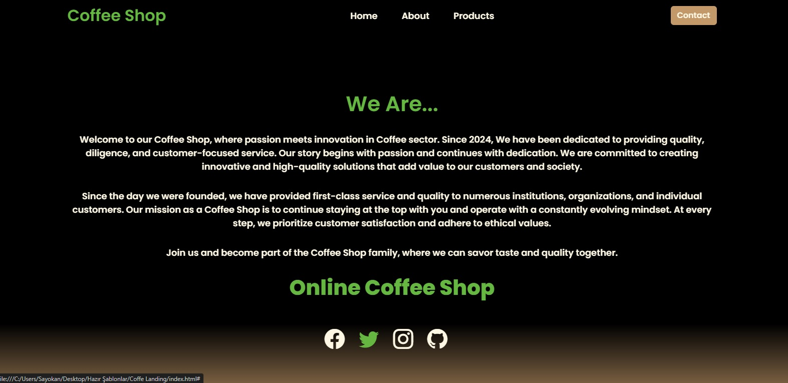
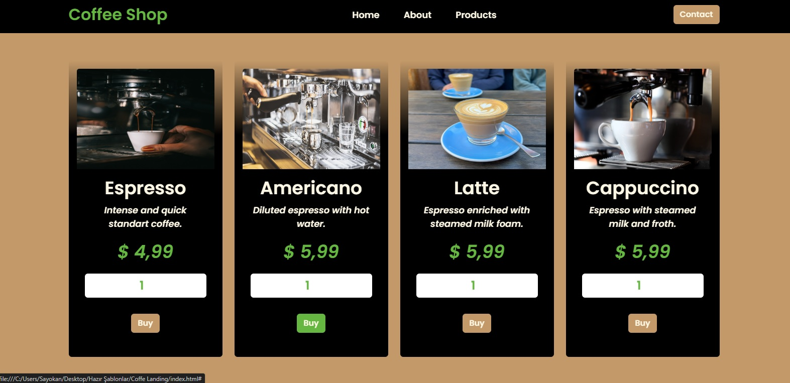

# Online Coffee Shop

This project is a web application for an online coffee shop developed using HTML, CSS, and JavaScript. It is designed using the Bootstrap CSS framework and is fully responsive, meaning it adapts to both large and small screens.

## Technologies and Tools Used

- HTML
- CSS (with Bootstrap framework)
- JavaScript

## Features

- The website is enriched with a user-friendly interface and interactive elements.
- It provides a responsive design that ensures a seamless experience across various devices.
- Bootstrap framework enables fast and modern design implementation.

## How to Use

1. Clone the project:

   ```bash
   git clone https://github.com/mustafaolgun/coffee_landing_page.git

   ```

2. Navigate to the project directory:

   ```bash
   cd coffee_landing_page

   ```

3. Double-click index.html to open it in a browser or run it on a web server.

## Screenshots







## Link

- Live Site URL: [Live Github Page](https://mustafaolgun.github.io/coffee_landing_page/)

## Author

- Github - [Mustafa Olgun](https://github.com/mustafaolgun)
- Codepen - [Mustafa Olgun](https://codepen.io/mustafaolgun)
